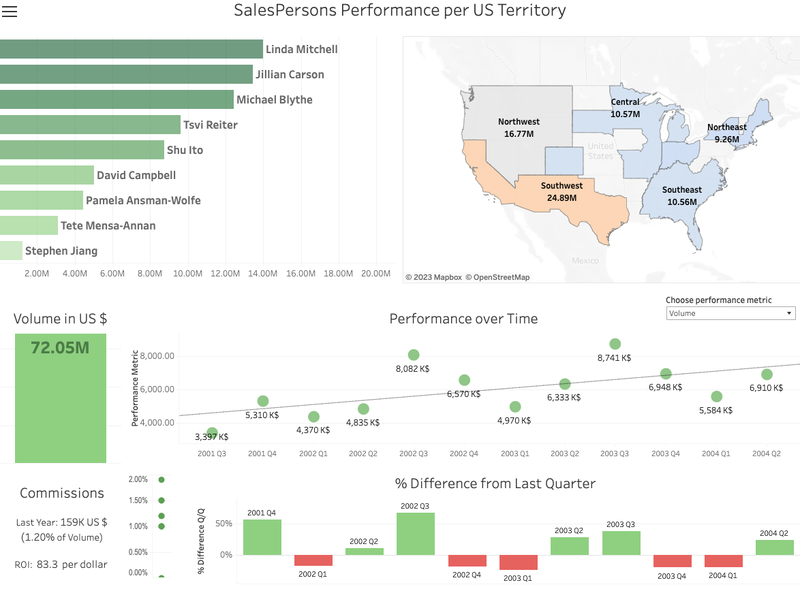
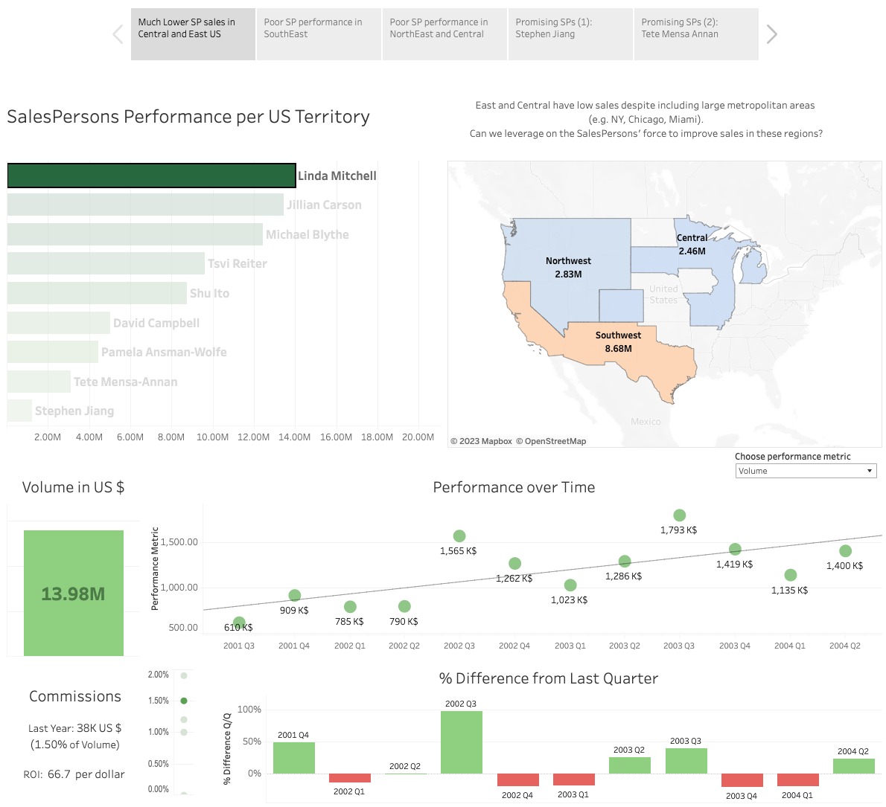

## Salespersons' performance 

### Quick Links
- [Preliminary EDA](https://docs.google.com/spreadsheets/d/1I0pLfQLiyjO6UDb-T-ox29nBXqUYynFj7NEGnPcN8Rc/edit?usp=sharing) (Google Sheets)
- [Dashboard for exploration](https://public.tableau.com/app/profile/leonardo.cerliani/viz/SP_Geo_v2/SalesPersonsPerformanceperUSTerritory)
- [Dashboard story with key insights](https://public.tableau.com/app/profile/leonardo.cerliani/viz/SP_Geo_v2_Story/SomeKeyInsights)
- [2 minutes presentation for Executive Leadership](2min_presentation.pdf)
- [10 minutes presentation for Sales Department](10min_presentation_Sales.pdf)
- SQL query to gather the data for preliminary analyses and for dashboards

### Background
[Adventureworks](https://learn.microsoft.com/en-us/sql/samples/adventureworks-install-configure?view=sql-server-ver16&tabs=ssms) is a fictitious company selling bikes and accessories. 

After conducting a 360º exploration of various aspects of this dataset, I decided to focus on investigating the reasons behind the variability in the performance of different salespersons, above and beyond the total amount of sales - e.g. career, experience, geographical location.

### Main preliminary results
- Volume of sales and Growth over quarters is slower in Central and Eastern US Territories

- We investigated to what extent this can be related to the the distribution of Salespersons across US regions (NorthWest, SouthWest, Central, NorthEast, SouthEast)

- We suggest that Western regions have an excess of SPs with growing trend, which could lead to market saturation in the near future.

- Instead, refocusing promising SPs in the Central and especially East regions could benefit their portfolio growth as well as the growth of the company market in these regions

- During the process we created a dashboard in Tableau that can also be provided to the Management and Sales department for further exploration and gaining additional insights

[Open the dashboard for exploration](https://public.tableau.com/app/profile/leonardo.cerliani/viz/SP_Geo_v2/SalesPersonsPerformanceperUSTerritory)

### Key Insights

Using this dashboard, one can derive many insights about how to improve sales in the Central and East US territories - as far as SPs’ sales are concerned.

For instance: 

- In the East there are much less SPs than on the West coast - and some of them are operating also in the West. Conversely, some SP are exclusively operating in the West. This is one reason that can explain the lower performance in the East.

- Some of the highest SPs performance is actually declining at the regional level - although it might look like it is increasing across regions.

- On the other hand, some SP are on a steady increase, but their activity is either too spread across regions or deployed in regions which are already saturated with SPs and doing very well while they could help improve the sales in Central and East.

- Also, some top SPs receive high commissions despite their stalled or declining performance while SP receive no commissions despite their increasing performance.

[Open the dashboard with key insights](https://public.tableau.com/app/profile/leonardo.cerliani/viz/SP_Geo_v2_Story/SomeKeyInsights)

### SQL query
https://github.com/leonardocerliani/TC_projects/blob/main/Bike_sales_dashboard/SQL_query_Salespersons.sql#L1-L29