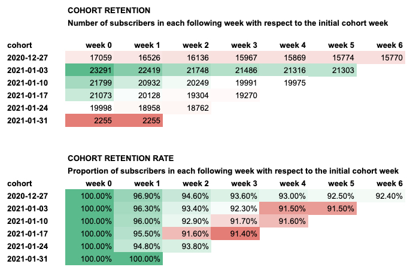

# Cohort retention and churn in SQL
_How to write a readable and adaptable query to calculate it in BigQuery SQL_


## Motivation

The main idea behind the calculation of cohort retention/churn is very simple. For instance, having defined a cohort of users as those who subscribe to a service/website in a given week, I would like to count how many are still subscribed in the following weeks (retention) and how many unsubscribe (churn). 

Calculating this metric for different cohorts (e.g. users subscribing in later weeks) can inform about the effect of different events - e.g. marketing campaigns or viral posts - onto our business.

**Despite its simplicity, an SQL query to calculate cohort retention/churn can become pretty complex and rigid**. This has disadvantages in terms of its maintainance and adaptability to different choices of _ad hoc_ analysis.

In the following I would like to show how to build a query which is easy to read and pretty adaptable to changes.

## Case study

Suppose you have a dataset like the following:

| user_pseudo_id        | subscription_start | subscription_end |
|-----------------------|--------------------|------------------|
| 83467479.3712028999   | 2020-11-01         | null             |
| 55666112.2535837096   | 2020-11-01         | null             |
| 3567303.5078176443    | 2020-11-02         | 2020-12-03       |
| 6417380.3726181994    | 2020-11-02         | null             |
| 8081585156.0442050150 | 2020-11-02         | null             |
| 1940972.5089265946    | 2020-11-03         | null             |
| 63964412.8050390474   | 2020-11-04         | null             |
| 91108794.8711815727   | 2020-11-04         | null             |
| 1526801.0560015811    | 2020-11-04         | 2020-11-05       |
| 17212306.7915035909   | 2020-11-06         | null             |

You would like to calculate user retention for the 6 weeks ending on 2021-02-07.

The final calculation should be displayed in the familiar triangular form



## Designing the query
A simple way of conceiving the query is by: 
1. First calculating the size of each cohort and storing it into a CTE. 
2. In another CTE we will store the churns per week in each cohort. **Crucially, the number of churns is just the count of the non-null elements in the `subscription_end` column**
3. At this point, we can simply calculate the cumulative sum of churn across weeks using a window function, 
4. Finally, we subtract the cumulative sum of churns per cohort/week from the cohort size to get the retention (or retention rate).

I will explain these passages separately below. The final complete query is at the end of the page

## 1. Define a cohort and calculate its size

Here each week is a cohort

```sql
with
distinct_users as 
(
  select 
    distinct user_pseudo_id,
    date_trunc(subscription_start, WEEK) as cohort,
    date_trunc(subscription_end, WEEK) as end_week,
  from 
    `turing_data_analytics.subscriptions`
  -- only consider the period of 6 weeks ending on 2021-02-07
  where date_diff('2021-02-07', subscription_start, WEEK) <= 6
  order by cohort
),

-- first-week subscriptions (cohort size) for each cohort
first_week_subscriptions as (
  select
    cohort, 
    count(*) as n_first_week,
  from distinct_users
  group by cohort
)
select * from first_week_subscriptions
```
Output:

| cohort     | n_first_week |
|------------|--------------|
| 2020-12-27 | 17059        |
| 2021-01-03 | 23291        |
| 2021-01-10 | 21799        |
| 2021-01-17 | 21073        |
| 2021-01-24 | 19998        |
| 2021-01-31 | 2255         |


## 2. Calculate number of churns for each following week in each cohort

This is the crucial passage. Instead of using multiple complex `CASE...WHEN...SUM` logics, which can be difficult to read and prone to errors, we realize that the number of churns is just the number of non-null elements in the `end_week` column. Therefore, if we group a `count(*)` by both `cohort` and `end_week`, we will have the number of churns per cohort and week.

We also calculate the number of weeks elapsed from the first one for each cohort. This will be useful to pivot the final table to get the expected triangular form. We add 1 to represent the number of customers churning during the first week.

```sql
-- n_churns for each week for each cohort
churns_by_week as (
  select
    cohort,
    end_week,
    date_diff(end_week, cohort, WEEK) + 1 as elapsed_weeks,
    countif(end_week is not null) as n_churns,
  from distinct_users
  group by
    cohort, end_week
  order by cohort, end_week
)
```
By selecting * from all the previous CTEs, we get:

<details>
<summary>Toggle output</summary>

| cohort     | end_week   | elapsed_weeks | n_churns |
|------------|------------|---------------|----------|
| 2020-12-27 | 0          |               |          |
| 2020-12-27 | 2020-12-27 | 1             | 533      |
| 2020-12-27 | 2021-01-03 | 2             | 390      |
| 2020-12-27 | 2021-01-10 | 3             | 169      |
| 2020-12-27 | 2021-01-17 | 4             | 98       |
| 2020-12-27 | 2021-01-24 | 5             | 95       |
| 2020-12-27 | 2021-01-31 | 6             | 4        |
| 2021-01-03 | 0          |               |          |
| 2021-01-03 | 2021-01-03 | 1             | 872      |
| 2021-01-03 | 2021-01-10 | 2             | 671      |
| 2021-01-03 | 2021-01-17 | 3             | 262      |
| 2021-01-03 | 2021-01-24 | 4             | 170      |
| 2021-01-03 | 2021-01-31 | 5             | 13       |
| 2021-01-10 | 0          |               |          |
| 2021-01-10 | 2021-01-10 | 1             | 867      |
| 2021-01-10 | 2021-01-17 | 2             | 683      |
| 2021-01-10 | 2021-01-24 | 3             | 258      |
| 2021-01-10 | 2021-01-31 | 4             | 16       |
| 2021-01-17 | 0          |               |          |
| 2021-01-17 | 2021-01-17 | 1             | 945      |
| 2021-01-17 | 2021-01-24 | 2             | 824      |
| 2021-01-17 | 2021-01-31 | 3             | 34       |
| 2021-01-24 | 0          |               |          |
| 2021-01-24 | 2021-01-24 | 1             | 1040     |
| 2021-01-24 | 2021-01-31 | 2             | 196      |
| 2021-01-31 | 0          |               |          |

</details>
<br>

## 3. Join cohort size and n_churns
Now we can join the first two table on the common `cohort` column. 

We also calculate the cumulative sum of churns for each cohort.

```sql
-- join cohort size (n_first_week) and n_churns per week per cohort
joint_cohort_churns_table as
(
  select
    fw.cohort,
    fw.n_first_week, 
    ch.elapsed_weeks,
    ch.n_churns,
    -- calculate the cumulative sum of churns over subsequent weeks (later used to calculate retention)
    sum(ch.n_churns) over (partition by ch.cohort order by ch.end_week) as cumsum_churns
  from first_week_subscriptions fw join churns_by_week ch 
    on fw.cohort = ch.cohort
)
```

## 4. Calculate retention values
At this point we have all the quantities to calculate the elements which will go into the retention table. Of course we can write the logic to calculate additional metrics - typically retention or churn rate 

```sql
-- calculate the final measure of retention and churn
select 
  cohort, 
  n_first_week, 
  case when elapsed_weeks IS NULL then 0 else elapsed_weeks end as elapsed_weeks, 
  n_churns,
  n_first_week - cumsum_churns as n_retention
from joint_cohort_churns_table
```

<details>
<summary>Toggle output</summary>

| cohort     | n_first_week | elapsed_weeks | n_churns | n_retention |
|------------|--------------|---------------|----------|-------------|
| 2020-12-27 | 17059        | 0             | 0        | 17059       |
| 2020-12-27 | 17059        | 1             | 533      | 16526       |
| 2020-12-27 | 17059        | 2             | 390      | 16136       |
| 2020-12-27 | 17059        | 3             | 169      | 15967       |
| 2020-12-27 | 17059        | 4             | 98       | 15869       |
| 2020-12-27 | 17059        | 5             | 95       | 15774       |
| 2020-12-27 | 17059        | 6             | 4        | 15770       |
| 2021-01-03 | 23291        | 0             | 0        | 23291       |
| 2021-01-03 | 23291        | 1             | 872      | 22419       |
| 2021-01-03 | 23291        | 2             | 671      | 21748       |
| 2021-01-03 | 23291        | 3             | 262      | 21486       |
| 2021-01-03 | 23291        | 4             | 170      | 21316       |
| 2021-01-03 | 23291        | 5             | 13       | 21303       |
| 2021-01-10 | 21799        | 0             | 0        | 21799       |
| 2021-01-10 | 21799        | 1             | 867      | 20932       |
| 2021-01-10 | 21799        | 2             | 683      | 20249       |
| 2021-01-10 | 21799        | 3             | 258      | 19991       |
| 2021-01-10 | 21799        | 4             | 16       | 19975       |
| 2021-01-17 | 21073        | 0             | 0        | 21073       |
| 2021-01-17 | 21073        | 1             | 945      | 20128       |
| 2021-01-17 | 21073        | 2             | 824      | 19304       |
| 2021-01-17 | 21073        | 3             | 34       | 19270       |
| 2021-01-24 | 19998        | 0             | 0        | 19998       |
| 2021-01-24 | 19998        | 1             | 1040     | 18958       |
| 2021-01-24 | 19998        | 2             | 196      | 18762       |
| 2021-01-31 | 2255         | 0             | 0        | 2255        |

</details>
<br>

These values can then be copied in Google Sheets / Excel, where we can generate the triangular table by simply placing `cohort` in the rows, `elapsed_weeks` in the columns, and the `n_retention` as a cell value.

## Final considerations
Of course the initial dataset can have a different form, however eventually we want to get to a table that looks like the one proposed at the beginning, and from there we can easily calculate the cohort retention values.

This formulation is quite long. Much shorter formulations can be written using complex logic. It is always great to have a concise logic, however when the option is between concise or readable, I prefer the second option.

The final table still needs to be imported in a spreadsheet for pivoting. Indeed it is possible to carry out the pivoting also in BigQuery directly. This can be obtained by enclosing the whole query in a select * and afterward using the `pivot` function:

```sql
select * from
(
    -- the whole query goes here
)
pivot
(
  sum(measure) as w
  for cohort_week in (0,1,2,3,4,5,6)
)
order by cohort
```

However I find it potentially cumbersome, especially if we want to modify the number of weeks to run the cohort analysis on.


## Full query

```sql
with
distinct_users as 
(
  select 
    distinct user_pseudo_id,
    date_trunc(subscription_start, WEEK) as cohort,
    date_trunc(subscription_end, WEEK) as end_week,
  from 
    `turing_data_analytics.subscriptions`
  -- only consider the period of 6 weeks ending on 2021-02-07
  where date_diff('2021-02-07', subscription_start, WEEK) <= 6
  order by cohort
),

-- first-week subscriptions for each cohort
first_week_subscriptions as (
  select
    cohort, 
    count(*) as n_first_week,
  from distinct_users
  group by cohort
),

-- n_churns for each week for each cohort
churns_by_week as (
  select
    cohort,
    end_week,
    date_diff(end_week, cohort, WEEK) + 1 as elapsed_weeks,
    countif(end_week is not null) as n_churns,
  from distinct_users
  group by
    cohort, end_week
  order by cohort, end_week
),

-- join cohort size (n_first_week) and n_churns per week per cohort
joint_cohort_churns_table as
(
  select
    fw.cohort,
    fw.n_first_week, 
    ch.elapsed_weeks,
    ch.n_churns,
    -- calculate the cumulative sum of churns over subsequent weeks (later used to calculate retention)
    sum(ch.n_churns) over (partition by ch.cohort order by ch.end_week) as cumsum_churns
  from first_week_subscriptions fw join churns_by_week ch on fw.cohort = ch.cohort
)

-- calculate the final measure of retention and churn
select 
  cohort, 
  n_first_week, 
  case when elapsed_weeks IS NULL then 0 else elapsed_weeks end as elapsed_weeks, 
  n_churns,
  n_first_week - cumsum_churns as n_retention
from joint_cohort_churns_table
```