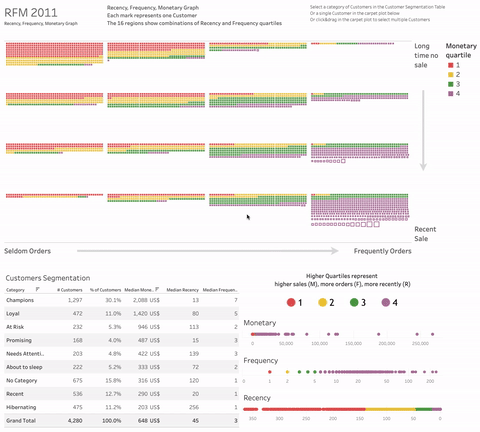

# Customer Segmentation Dashboard

**Customer Segmentation is aimed to differentiate customers in order to devise appropriate business actions**. For instance, bonuses for loyal customers or recall for valuable customers that might consider churning.

**Recency, Frequency, Monetary (RFM) analysis** is a common approach for extracting features that would map onto different categories of customers.

A dashboard displaying the RFM scores for each customer can help to empower stakeholders with both: 
- a bird's eye perspective on the whole customer base
- the ability to drill down the analysis to the level of the single customer.

These represent the main principles around which we built the dashboard, which can be [explored at this link](https://public.tableau.com/app/profile/leonardo.cerliani/viz/RFM_V3/MRF_dash_V3) (please open in full screen mode)



The whole analysis is detailed in [this notion page](https://airy-camera-dce.notion.site/RFM-and-CLV-graded-task-96a42877b0f84b4aa172900918cf5532). 

SQL queries to extract the data fed into Tableau can be found below


---

<details>
<summary>SQL query to calculate RFM scores</summary>

```sql
/*
  The following query calculates Recency, Frequency, Monetary scores (quartiles)
  from the `turing_data_analytics.rfm` table.
  Higher quartiles/scores (e.g. 4-4-4) are better, i.e. more recent and frequent orders, 
  as well as higher amount 
*/

with
-- calculate the RFM values, to prepare for calculating the RFM scores (quartiles)
RFM_values as 
(
  with
-- get the total of each sale for each customer (i.e. each invoice)
total_per_invoice as
(
  select
    CustomerID,
    InvoiceNO,
    date(InvoiceDate) as InvoiceDate,
    round(sum(UnitPrice * Quantity),2) as TotalDue,
  from  
    `turing_data_analytics.rfm`
  where
    CustomerID is not null
  group by 
    CustomerID, InvoiceNO, InvoiceDate, country
)
-- main query to calculate RFM values (to prepare for RFM scores)
select
  CustomerID,
  min(date_diff(date "2011-12-01", InvoiceDate, DAY)) as recency, -- days since the oldest order
  count(InvoiceNO) as frequency, -- total number of orders (# of invoices)
  round(sum(TotalDue),2) as monetary -- sum across all invoices for that customer
from
  total_per_invoice
where
  InvoiceDate between date "2010-12-01" and date "2011-12-01"
group by
  CustomerID
having 
  monetary > 0  -- for some reason some US$ amounts were negative, so we exclude them
order by
  recency desc, customerID
),

-- RFM_scores (quartiles)
RFM_scores as 
(
  select 
    CustomerID,
    -- Higher scores (444) are better than lower scores (111)
    -- Therefore the rank (1-4) is left as it is for Frequency (# orders) and Monetary (TotalDue)
    -- and reversed for Recency (less days from last order is better) 
    recency,    5 - ntile(4) over (order by recency) as R_qtile,
    frequency,  ntile(4) over (order by frequency) as F_qtile,
    monetary,   ntile(4) over (order by monetary) as M_qtile,
  from 
    RFM_values
  order by R_qtile desc, F_qtile desc, M_qtile desc
)

select * from RFM_scores
order by monetary desc


-- /* 
--   To check that the values have been assigned to the right quartiles, comment the select * above
--   and uncomment ONLY ONE of the lines below AT A TIME 
-- */
-- select
--   -- distinct M_qtile as quartiles,  max(monetary) over (partition by M_qtile order by M_qtile) as M_quartiles,
--   -- distinct R_qtile as quartiles,  max(recency) over (partition by R_qtile order by R_qtile) as R_quartiles,
--   -- distinct F_qtile as quartiles,  max(frequency) over (partition by F_qtile order by F_qtile) as F_quartiles,
-- from
--   RFM_scores
-- order by quartiles
-- ;
```
  
</details>
  


<details>
<summary>SQL query to calculate cohort matrix for CLV</summary>

```sql
/*
  Starting from a dataset containing
  - user id
  - date of event
  - amount spent
  this query creates cohorts of users based on the earliest
  event for each user.
  
  It also calculates the # of users in each week to derive the
  metric of interest:

  AOV (Average Order Value) = TotalDue / # of users
  for each week in each cohort.

  The final cohort matrix is calculated by aggregating (sum)
  over cohort and week.

  A column representing the elapsed weeks for each cohort is
  also generated to facilitate the pivoting of the matrix
  in Google Sheets
*/


-- Assign the cohort to each user based on the week
-- in which the user's earliest event occurs
with
user_cohort as
(
  select 
    user_pseudo_id,
    min(date_trunc(parse_date('%Y%m%d', event_date),WEEK)) as cohort
  from
    `turing_data_analytics.raw_events`
  group by user_pseudo_id
),

-- Calculate how many users are there in the cohort 
-- This will be used to calculate TotalDue / # Users per week
users_per_cohort as
(
  select
    cohort,
    count(user_pseudo_id) n_users_cohort
  from
    user_cohort
  group by cohort
),

-- Calculate the total spent for each user each week
user_totaldue_per_week as
(
  select
    user_pseudo_id,
    date_trunc(parse_date('%Y%m%d', event_date),WEEK) as week_date,
    sum(purchase_revenue_in_usd) as totaldue
  from
    `turing_data_analytics.raw_events`
  group by user_pseudo_id, week_date
),

-- Put everything together in one dataframe before
-- aggregating across users in each week 
df as
(
  select 
    user_cohort.user_pseudo_id,
    user_cohort.cohort,
    user_totaldue_per_week.week_date,
    user_totaldue_per_week.totaldue,
    n_users_cohort,
  from user_cohort 
    join user_totaldue_per_week on user_cohort.user_pseudo_id = user_totaldue_per_week.user_pseudo_id
    join users_per_cohort on user_cohort.cohort = users_per_cohort.cohort 
)

-- Aggregate across users for each week by calculating
-- TotalDue / # Users
-- and create the cohort matrix (to be pivoted)
select
  cohort,
  week_date,
  round(sum(totaldue) / n_users_cohort,2) as AOV,
  rank() over (partition by cohort order by week_date) - 1 as elapsed_weeks -- useful for reordering the cohort matrix
from  
  df
group by
  cohort, week_date, n_users_cohort
order by cohort

```

