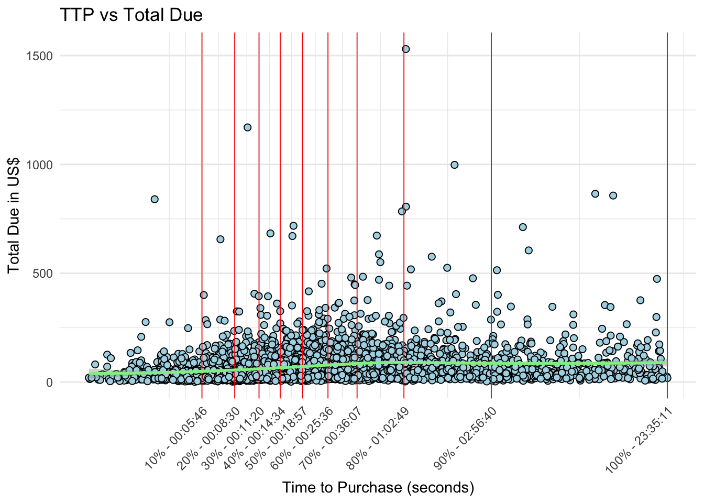
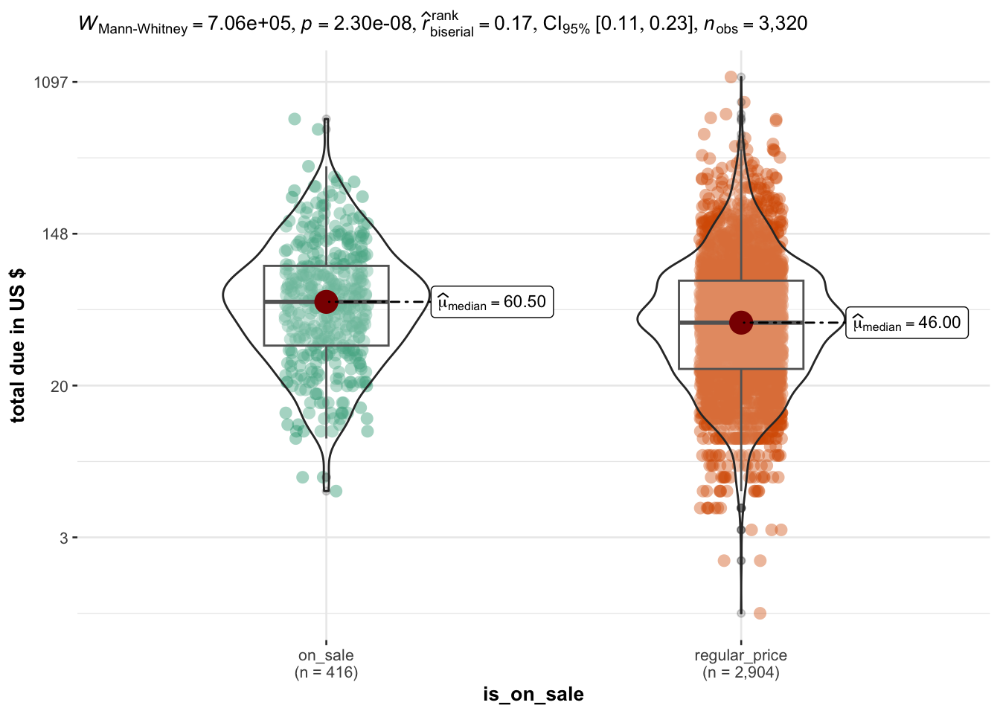

# Summary

**Background** : While the session time on e-commerce websites rarely exceeds 10 minutes [[1](https://blog.hubspot.com/marketing/chartbeat-website-engagement-data-nj),[2](https://www.statista.com/statistics/790897/unique-visitors-average-session-durations-retail-properties-us/)], the duration of purchasing sessions varies from a few minutes to hours. 

**Objectives**
Gathering information about purchasing session time and amount spent for different category of users, in order to provide personalized UX and identify potential weaknesses to be addressed.

**Analytical strategy**
We conduct our analysis on the event-level data from the [Google Merchandise Store](https://shop.googlemerchandisestore.com/).

First we define a limit on session duration, based on the increase in total due over time.

Then we investigate how the time-to-purchase (TTP) varies in different categories of customers, specifically:
- customers buying from the ON SALE section of the website
- returning customers
- referral customers

**Main insights**
- **The median session time is less than 20'**. Order value increases only for sessions up to 1 hour, but _without_ a strong association (i.e. shorter sessions can result in more expensive orders, or _vice versa_)

- **Users from ON SALE section have longer sessions and significantly higher expenditures**

- **Returning customers** are marginally faster to complete the purchase, however their order value is comparable to those of new customers

- **Referral customers** have similar session time and order value of other customers

**Recommendations and Future development**

- **Focus on sleek UX**: It does not appear that longer session would increase sales or order value, therefore any plan (if present) to increase the complexity of the webstore - to increase the time spent navigating the webstore - should be evaluated with caution

- **Potentiate the ON SALE section**: The ON SALE section of the website drives longer sessions (~ 25 minutes) and higher revenues than all the other sections. Currently it attracts about 12% of the visitors. On the basis of the current data, a potentiation of the ON SALE section has the best prospect for increasing revenues

- **Activate recurring customer**: Currently, recurring customers are faster to purchase, but do not spend more than new customers. This suggests that the UX is not building enthusiasm for the products. One could explore using personalized recommendation and - if this improves sales - implementing a “Suggested for You” section on the website based on historical data.

AOV increases up to 30-60', however the association is not straightforward.

 

Customers purchasing in the ON SALE section of the website have longer session times and higher AOV